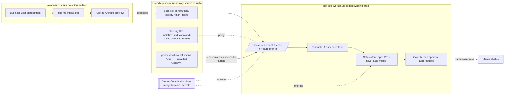

# ADLC — Solution Design

> **Status:** Confirmed direction at the Adastra-team level (2026-06-09); **Orix ratification pending.** Full evaluation and rationale live in `Docs/8_Solution_Roadmap_Research/`.

## Summary

The ADLC turns **business intent into a reviewed pull request** — *intent → spec → generate → test → PR* — by composing a small set of **permissively-licensed (MIT) building blocks that we fork and own**, rather than adopting a single end-to-end tool. It runs on a **hybrid runtime**: the **claude.ai web app** captures intent, **Claude Code** does spec + generation, and **GitHub Actions** runs the headless, gated orchestration. No single framework spans the whole lifecycle, so the **test-gate → PR → no-direct-merge last mile is owned deliberately** — that is where the financial-services governance lives.

## Why a composition (not one repo)

A single out-of-the-box repo was the goal — but none survives the constraints (verified live, 2026-06-09). The open spec frameworks all stop before the governed last mile: **Spec-Kit** ends at `/implement`, **OpenSpec** has no PR/CI and is explicitly anti-gate, and **BMAD v6** (MIT, ~48k★) still creates no PRs, enforces no CI gate, and ships its web tier as Gemini/ChatGPT bundles — not claude.ai, the Orix-confirmed UI. The genuinely end-to-end *single tools* (Augment Cosmos, Amazon Kiro) are proprietary SaaS — unforkable, and disqualified by the permissive-license / fork-and-own / client-tenancy constraints. So the optimum is forced: adopt the strongest **forkable** open spine — Spec-Kit, the only one with GitHub/Microsoft backing, Azure-aligned and Claude-native — and **own the test-gate → PR → no-direct-merge last mile**, which is exactly where the financial-services governance lives.

## The stack

| Layer | Component | License | Role |
|---|---|---|---|
| Spec spine | **GitHub Spec-Kit** | MIT | `specify → plan → tasks → implement`; spec-phase review checkpoints + `/speckit.analyze` quality gate (the **merge** gate lives in orchestration, not here) |
| Orchestration | **GitHub Agentic Workflows (gh-aw)** | MIT | Label-driven GitHub Actions; read-only default + gated "safe outputs" (open PR, never auto-merge) |
| Claude-in-CI | **claude-code-action** | MIT | Runs Claude Code headless in Actions; `use_foundry` makes Azure billing native |
| Enforcement & roles | **Claude Code hooks / subagents / skills** | platform | Deterministic `PreToolUse` deny (no merge to `main`, no secrets); per-phase roles + model routing |
| Vendored skills | grill-me + handoff, `review-agent-governance`, TDD/verification | MIT | Intent capture, context handoff, signed-approval gate, behavioral discipline |

> **Maturity note:** gh-aw is a GitHub **technical preview** (pre-1.0). We pin a release and vendor the compiled `*.lock.yml` (no runtime dependency on upstream); if it destabilizes, the design degrades gracefully to hand-rolled GitHub Actions + `claude-code-action`.

## Architecture

## Operating model

- **Two repos.** `orix-adlc-platform` = read-only source of truth (steering files, vendored frameworks, workflow definitions). `orix-adlc-workspace` = the agent's working area, where features are scaffolded and **PRs land for human review**.
- **Hybrid runtime.** Intent in claude.ai web (Claude Artifacts is the native preview) → spec + generate in Claude Code → headless, gated orchestration in GitHub Actions.
- **Generated code is tech-agnostic, with no database and no external integrations** (confirmed MVP scope). This applies to the generated app, not the platform.

## Governance posture (financial-services)

- Agents are **read-only by default**; every write is a permission-scoped "safe" output.
- **No direct merge to `main`** — a human approval gate is required before a PR is merge-eligible.
- Enforcement is **deterministic** (Claude Code hooks deny writes to protected paths / secret patterns), not left to model judgment.
- **Audit trail** = portable, git-tracked markdown artifacts (`spec.md` / `plan.md` / `tasks.md`) + a signed log of agent actions.

## Mapping to the signed SOW

The SOW frames the work as a two-plane model (**Innovation Plane / Control Plane**) over *intake → sanitization → refactoring*. This design satisfies that contract under the confirmed "generate-from-intent" model: the **Innovation Plane** = the spec spine + generation (claude.ai web + Spec-Kit + Claude Code); the **Control Plane** = the gated orchestration, hooks, and human approval gate. "Intake" = intent capture; "sanitization" = SAST/SCA/secret-scan dropped in as gh-aw safe-output **gate jobs**. SOW out-of-scope (APIM, full IaC, HA/DR, full E2E) stays out.

## Later adapter layers (do not block the build)

- **Azure / Foundry billing:** the **headless pipeline** (claude-code-action in CI) bills through Foundry via a config flip (`CLAUDE_CODE_USE_FOUNDRY` / `use_foundry: true`) when ratified — no code change. ⚠ The **interactive claude.ai web** intent-capture leg stays Anthropic-billed (off-Azure); Foundry cannot capture that spend.
- **Skill packaging:** the whole flow can be packaged as a single auto-loading Claude Skill that points back at `orix-adlc-platform` as the source of truth.

## Adoption

Fork-and-own under permissive licenses, vendored and version-pinned into the two repos — **no runtime dependency on upstream**. Delivery sequence is in `Docs/10_Delivery_Roadmap.md`; the first validation slice is in `Docs/8_Solution_Roadmap_Research/POC_PLAN.md`.
