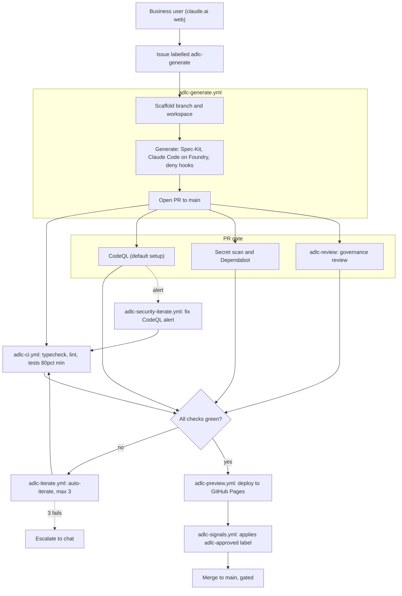

# ADLC Pipeline — GitHub Actions & YAML

How a plain-language feature request becomes a reviewed, gated pull request.
Stage tags reflect verified status: **✅ working/validated · 🔜 planned (WS#) · ⚠️ needs fix**.
The gh-aw generate spine was **validated live end-to-end on 2026-06-22** (issue #39 → PR #40 → live Pages preview); see `docs/superpowers/2026-06-22-ghaw-generate-smoke-outcome.md`.

*Legend: `*.yml` = hand-rolled workflow (always-wired fallback) · `adlc-generate`/`adlc-review` = gh-aw (live) · CodeQL and Secret scan + Dependabot = GitHub-native.*

## Intent capture (claude.ai web) — 🔜 WS7

A business user works in claude.ai web. A single packaged **ADLC Skill** bootstraps the session: via the **GitHub MCP connector** it reads the vendored `grill-me` and `handoff` skills live from the repo and follows them. grill-me runs the interview; a **Claude Artifacts** preview shows the proposed app before any build; on confirmation it creates a GitHub issue labelled **`adlc-generate`** whose body is the full spec.

## adlc-generate (Phases 3–7)

Orchestrated by the **gh-aw** `adlc-generate.lock.yml` (primary, `if: vars.ADLC_ENGINE != 'legacy'`). The hand-rolled `adlc-generate.yml` is **not parked** — it stays fully wired as an always-ready fallback, kept mutually exclusive by the `ADLC_ENGINE` guard and auto-engaged by the 2-strike `adlc-failover.yml` controller (or instantly via `ADLC_ENGINE=legacy`).

- **Phase 3 — Scaffold** ✅ The `adlc-generate` label is the trigger. A deterministic pre-agent step (`adlc-prep.sh`) creates `workspaces/<slug>/`, the `feature/issue-<N>-<slug>` branch, and `status.json` (the channel the chat side reads). Fallback B: the scaffold is left **uncommitted** so the agent's own commit bundles it into the PR.
- **Phases 4–6 — Generate** ✅ (validated 2026-06-22). One atomic CI job run by **claude-code-action** (`engine: claude`) on Azure AI Foundry via `ANTHROPIC_BASE_URL` + the `ANTHROPIC_API_KEY` secret — the **base-URL method**, *not* `CLAUDE_CODE_USE_FOUNDRY` (strict mode blocks it); model `claude-sonnet-4-6`. Before the agent starts, **deterministic `PreToolUse` deny hooks** are mounted (no writes outside `workspaces/<slug>/`, no push/merge to `main`, no secrets, no dangerous Bash) and fire under the engine's `acceptEdits` mode. The agent follows the **Spec-Kit spine** seeded by the issue intent — `constitution → specify → plan → tasks → implement` — writing `spec.md`/`plan.md`/`tasks.md` as the audit trail and **tests first** (vendored `tdd-verification` skill), then validating (`npm run ci`, coverage ≥80%) and self-checking against the acceptance criteria.
- **Phase 7 — Open PR** ✅ Opens `feature/...` → `main` as a gh-aw **safe output**, authored by **`ADLC_AGENT_TOKEN`** (the safe-output's `github-token`) — required so the PR (a) clears the org's "Actions can't open PRs" restriction and (b) actually triggers the downstream `pull_request` workflows; a `GITHUB_TOKEN`-opened PR triggers none. Status → `pr-open`. Never auto-merged.

## PR gate

Triggered when the PR opens:

- **CI** ✅ `adlc-ci` runs `tsc --noEmit` + `eslint` + `vitest --coverage` (80% min) + a banned-package check.
- **CodeQL** ✅ runs via GitHub **default setup** — checks `Analyze (actions)` and `Analyze (javascript-typescript)`. (No `codeql.yml` in the repo, and none should be added.)
- **Secret scanning + Dependabot** 🔜 WS5. Secret-scanning push protection blocks secrets at push time; Dependabot raises dependency alerts/PRs.
- **Governance review** ✅ (live, advisory — validated 2026-06-22). The `adlc-review` gh-aw workflow runs `review-agent-governance`: reviews the diff against the constitution + compliance rules, posts a structured verdict (`observations-only | changes-requested`), and applies `adlc-iterate` on blocking findings — but **never approves**. *Audit record:* the comment carries gh-aw's immutable provenance footer (workflow id, run URL, model); the planned machine-readable `<!-- adlc-audit … -->` marker is a **deferred WS6 follow-up** — it relied on the agent emitting it, which the smoke showed is unreliable (see the smoke-outcome doc).

## Phase 8 — Auto-iterate ✅ (security loop ⚠️ WS5)

CI failure, a changes-requested review, or a **`/adlc-iterate:`** PR comment re-invokes Claude Code with the failure context. Up to **3** attempts; each is a fresh CI run; hitting the cap **escalates to chat**.
⚠️ The CodeQL remediation loop (`adlc-security-iterate.yml`) guards on `check_run.name == 'Analyze'`, which never matches the default-setup check names — so it has never fired (all runs `skipped`). WS5 changes the guard to `startsWith(github.event.check_run.name, 'Analyze')`.

## Phase 9 — Deploy preview ✅

On `adlc-ci` success (`workflow_run`), `adlc-preview.yml` builds the changed workspace, publishes it to **GitHub Pages** at `previews/pr-<N>-<slug>/`, posts the URL as a PR comment, and sets status `preview-deployed`. A `deploy-failed` is flagged for a human and never auto-iterated. **Validated on the gh-aw path (2026-06-22):** PR #40's preview served at `previews/pr-40-issue-39-hello-greeting/` (HTTP 200).

## Phase 10 — Review + gated merge 🔜 WS6

The business user opens the live preview from claude.ai. Approval posts **`/adlc-approved:`**, which `adlc-signals.yml` turns into the `adlc-approved` label, flipping the required **`adlc/business-approval`** check green. Small changes loop back via `/adlc-iterate:`; spec-level changes trigger SPEC ROLLBACK.
A branch-protection rule on `main` blocks merge until **all required checks pass + at least 1 CODEOWNERS review + `adlc/business-approval` is green**, and forbids direct pushes. A human performs the merge — nothing auto-merges.

## Orchestration & fallback

gh-aw compiled `*.lock.yml` workflows are primary; the hand-rolled `*.yml` workflows are **not parked** — they stay fully wired as an always-ready fallback, kept mutually exclusive by the `ADLC_ENGINE` repo-variable `if:`-guard (`gh-aw` ⇒ gh-aw runs / hand-rolled skips; `legacy` ⇒ the reverse). The plain-Actions `adlc-failover.yml` controller auto-routes to the hand-rolled generator after **2 gh-aw strikes** (via the `adlc-fallback` label); `ADLC_ENGINE=legacy` is the instant all-issues override — no workflow edits, no double-runs (see `INFRA-SETUP.md` §L). *(Iterate is hand-rolled only — never ported, because gh-aw strict mode bans the `contents: write` its cap-3/status pushes need.)*
